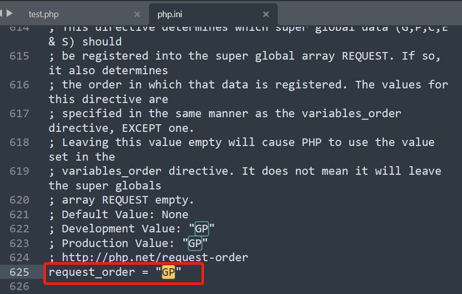
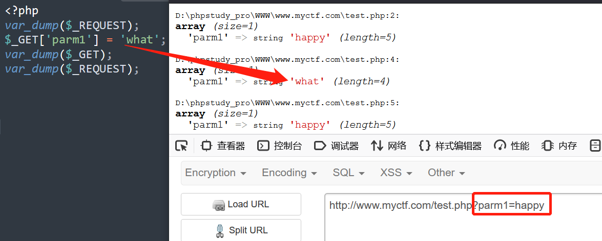
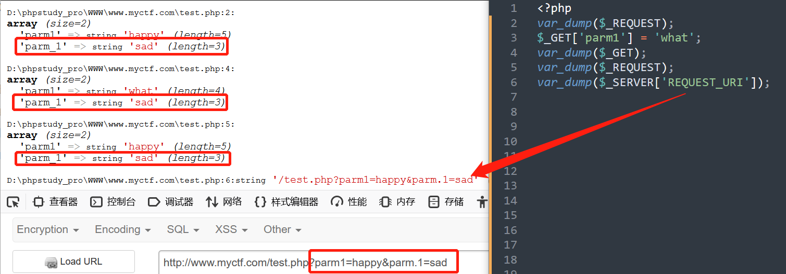
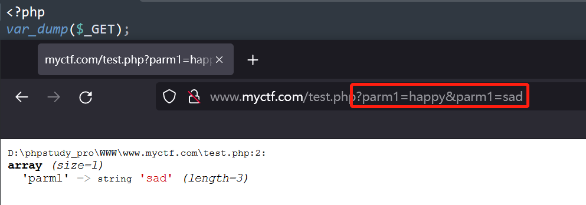

## PHP中有一些内置类

1. `SimpleXMLElement`  其中当`$data ` 为XML数据， `$options=2`时易造成**XXE注入**。[这里](https://www.php.net/manual/en/libxml.constants.php)

```php
final public SimpleXMLElement::__construct ( string $data [, int $options = 0 [, bool $data_is_url = FALSE [, string $ns = "" [, bool $is_prefix = FALSE ]]]] )
```
2. `GlobIterator` 其中`$pattern`为要搜索的文件名，`$flags`may be a bitmask of the [FilesystemIterator](https://www.php.net/manual/zh/class.filesystemiterator.php) constants。

```php
public GlobIterator::__construct ( string $pattern [, int $flags = FilesystemIterator::KEY_AS_PATHNAME | FilesystemIterator::CURRENT_AS_FILEINFO ] )
```

## PHP反序列化问题

主要是总结传入序列化字符串如何**绕过过滤 **以及 反序列化为一个对象时**魔术方法的调用**

#### 绕过姿势：

- 序列化字符串中 代表这是一个*对象的序列化字符串*的`O:`字符后面添加一个`+`可以绕过形如`/O:\d:/`这样的正则，因为源码`var_unserializer.c`中有代码能够解析`O:+数字`这样的对象序列化。

- 对于`protected`和`private`类型的变量在序列化的时候有点复杂：

  对象的私有成员具有加入成员名称的**类名称**;

  受保护的成员在成员名前面加上**’*’**。

  这些前缀值在任一侧都有**空字节**。

  这里有两种办法使字符串完整：①在空字节位置添加`%00`；②使用`S:5:"\00*\00op"`,因为如果类型为`S`，PHP的源码会将`\00`按十六进制处理，也就是空字节。

- 序列化字符串的逃逸。

#### 魔术方法（反序列化如何利用）

- 看[这篇](https://www.cnblogs.com/20175211lyz/p/11403397.html)文章挺好的。

  > __wakeup() //使用unserialize时触发
  >
  > __sleep() //使用serialize时触发
  >
  > __destruct() //对象被销毁时触发
  >
  > __call() //在对象上下文中调用不可访问的方法时触发
  >
  > __callStatic() //在静态上下文中调用不可访问的方法时触发
  >
  > __get() //用于从不可访问的属性读取数据
  >
  > __set() //用于将数据写入不可访问的属性
  >
  > __isset() //在不可访问的属性上调用isset()或empty()触发
  >
  > __unset() //在不可访问的属性上使用unset()时触发
  >
  > __toString() //把类当作字符串使用时触发
  >
  > __invoke() //当脚本尝试将对象调用为函数时触发

  [一道质量很高的PHP反序列化CTF题](https://pan.baidu.com/s/19bwfyd1RUpokD23pwiXcfg)------提取码：54dt 

## CMS可能存在的部分逻辑问题

1. install.php在安装完成后应该删除或者做访问控制，当已安装时再访问，应当在输出警告信息后**退出程序**，否则程序继续执行的话，就会导致重装漏洞。审计的时候注意`die()`和`exit()`

## $_REQUEST相关安全问题

- $_REQUEST获取参数的顺序：这个主要看php.ini是如何配置的，一般情况都是GPCS的顺序，即GET、POST、COOKIE、SERVER，**且从左往右优先级增大**。

  

  

  

- `$_REQUEST`是直接从GET，POST 和 COOKIE中取值，不是他们的引用。即使后续`GET，POST 和 COOKIE`发生了变化，也不会影响`$_REQUEST`的结果。

  

- **PHP特性：**①php自身在解析请求的时候，如果参数名字中包含空格、`.`、`[`这几个字符，会将他们转换成`_`。②通过`$_SERVER['REQUEST_URI']`方式获得的参数并不会进行转换。

  

  另外一个特性是：**当我们使用HPP（HTTP参数污染）传入多个相同参数给服务器时，PHP只会接收到后者的值。（这一特性和中间件有关系）**

  

可以利用这些特点绕过某些过滤WAF。审计的时候要注意WAF处理的参数是怎么获取的，业务处理的参数是怎么获取的。
