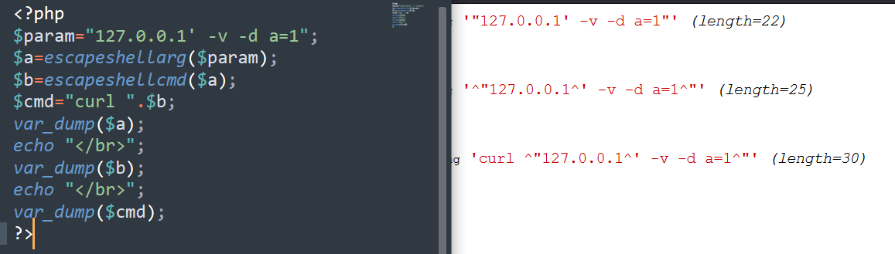
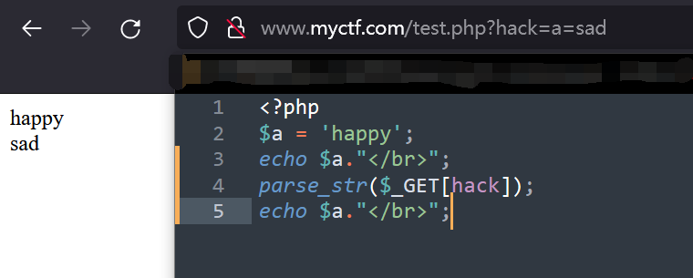

## in_array()

> 功能： 检查数组中是否存在某个值。
>
> 定义： **in_array**      ( [mixed](mk:@MSITStore:C:\Users\badbird\Desktop\php_enhanced_zh.chm::/res/language.types.declarations.html#language.types.declarations.mixed) `$needle`     , array `$haystack`   , bool `$strict` = **`false`**     ) : bool
>
> 解释：大海捞针，在大海（`haystack`）中搜索针（ `needle`），如果没有设置 `strict` 则使用宽松的比较。

当in_array()函数的第三个参数未设置为true时（默认为false），会进行弱比较。例如：

  ```php
  $exp = '2shell';
  $whitelist = array(0,1,2,3,4,5);
  # 此时如果调用 in_array($exp,$whitelist);  是会判定为true的。
  ```

当第三个参数设置为true时，就会进行强比较，会比较类型的。


## filter_var()

函数定义如下：

> 功能：使用特定的过滤器过滤一个变量。
>
> 定义：filter_var( mixed $value, int $filter = FILTER_DEFAULT, array|int $options = 0) : mixed

该函数可调用指定的PHP内置的过滤器来过滤一个变量，如果符合过滤器的要求就返回原`$value`。比如，如果指定的是`FILTER_VALIDATE_URL`过滤器的话。`FILTER_VALIDATE_URL` 过滤器把`$value`作为 URL 来验证，验证其是否是URL格式的字符串，但是有一个很大的问题是  这个过滤器的”宽容性很高“，类似于`qwe://`这种形式的URL都可以通过它的过滤。


经过一些测试发现，形如`xxx://xxx`即可验证通过该过滤器。但是如果前半部分是`http://`的话，正斜杠后边不允许有特殊字符了。比如`http://><"";''`是不行的但是`qwe://><"";''`确实可以通过过滤的。

[这里有一篇该函数相关的技术文](http://www.52bug.cn/hkjs/4631.html)

## class_exists()

> 功能：检查类是否已定义。
>
> 定义：**class_exists**    ( string `$class`   , bool `$autoload` = true   ) : bool
>
> 解释：检查指定的类是否已定义。$autoload是是否默认调用__autoload函数。

一个可以造成任意文件包含漏洞的例子。

```php
<?php 
	function __autoload($classname){
    	echo 'I\'m working...';
		include $classname;
	}
	$classname = $_GET['c'];
	if (class_exists($classname)) {
		echo 'balbala';
	} else {
		echo 'There is no page';
	}
?>
```

这段代码的本意作用是：参数c获取一个`classname` ,`class_exists()`判断其值是否是被定义好的类，如果程序中没有定义该类，就会默认调用`__autoload()`将其包含到程序代码中。

这里就有一个任意文件包含漏洞，可以使用`../`路径穿越来实现任意文件包含。但是，只有在**PHP5~5.3（含）**中才可以在`class_exists()`中传入`../`达到目的，高版本php中向`class_exists`中传入`../`是**不会调用**`__autoload()`的。

## strpos()

> 功能：查找字符串首次出现的位置
>
> 定义：**strpos** ( string `$haystack`   , [mixed](mk:@MSITStore:C:\Users\badbird\Desktop\php_enhanced_zh.chm::/res/language.types.declarations.html#language.types.declarations.mixed) `$needle`   , int `$offset` = 0   ) : int
>
> 解释：返回 `needle` 在 `haystack` 中首次出现的数字位置。如果提供了`$offset`，搜索会从字符串该字符数的起始位置开始统计。如果是负数，搜索会从字符串结尾指定字符数开始。 

这个函数可能会被利用的点在于，例如下面这段代码：

```php
<?php
$a = $_GET['a'];
$b = $_GET['b'];
if (!strpos($a, '<') && !strpos($b, '>')) {
    if (strstr($a, '<') && strstr($b, '>')) {
    	echo 'That\'s ok.';
    } else {
        echo 'No No No.';
    }
} else {
    echo 'No No No.';
}
?>
```

这段代码的**本意**是：如果参数`a`中不含有`<`且参数b中不含有`>`，又 如果参数`a`中含有`<`且参数`b`中含有`>`，就输出`That's ok.` 。其余情况都输出`No No NO.` 。听起来确实是自相矛盾，但是是为了更好的理解这个函数。**在这段代码中传入`?a=<&b=>`即可通过所有的判断。**

在PHP手册中查询`strstr()`函数的用法，会看到这样一句话：


但是，`strpos()`函数并不能像上述案例代码那样使用。有一种特殊的情况即：`<`是在`$a`的首位置时，`strpos()`会返回**0**，因为本身strpos()函数的功能就是**查找字符串首次出现的位置**。而`!0`为`true`。所以除了`$a`中不存在`<`这种办法可以使第一个if判定为真外，将`<`写在`$a`的第一个字符位置也是可以的。

## escapeshellarg()

## escapeshellcmd()

> 功能：escapeshellarg()把字符串转码为可以在 shell 命令里使用的参数。
>
> 功能：escapeshellcmd()对字符串中可能会欺骗shell命令执行任意命令的字符进行转义。此函数保证用户输入的数据在传送到`exec()`或`system()`函数，或者`执行操作符`之前进行转义

原理很简单，就是`escapeshellarg()`为了转义字符而加上的`\`又被`escapeshellcmd()`转义了。具体原理和漏洞案例看[这里](https://paper.seebug.org/164/)。

但是我在**Windows环境**下做测试，PHP5.2.17中，原字符串中有没有单引号都“不影响”最后的结果。而大于5.2的版本，无论如何都达不到逃逸的目的。

PHP5.2.17 字符串中无单引号：


PHP5.2.17 字符串中有单引号：


PHP>5.2.17 字符串中有单引号（`^`是windows中的转义字符）:



## preg_replace()

> 功能：执行一个正则表达式的搜索和替换
>
> 定义：**preg_replace**  ( string|array `$pattern`   , string|array `$replacement`   , string|array `$subject`   , int `$limit` = -1   , int `&$count` = **`null`**   ) : string|array|null
>
> 解释：搜索 `subject` 中匹配 `pattern` 的部分，以   `replacement` 进行替换。 

其中以前最大的问题是 `$pattern`的`/e`修饰符带来的代码执行问题。但只在**PHP<5.5.0**有效了。

经典案例：

```php
preg_replace('/(.*)/ei', 'strtolower("\1")', {${phpinfo()}});
```

PS：可以看看[这个](https://xz.aliyun.com/t/2557)

补充一个名词：反向引用

> **反向引用**
>
> 对一个正则表达式模式或部分模式 **两边添加圆括号** 将导致相关 **匹配存储到一个临时缓冲区** 中，所捕获的每个子匹配都按照在正则表达式模式中从左到右出现的顺序存储。缓冲区编号从 1 开始，最多可存储 99 个捕获的子表达式。每个缓冲区都可以使用 '\n' 访问，其中 n 为一个标识特定缓冲区的一位或两位十进制数。

新学到了另一个问题，首先看看官方对第二个参数的部分描述：

> `replacement` 中可以包含后向引用 `\\n` 或 `$n`，语法上首选后者。 每个这样的引用将被匹配到的第 n 个捕获子组捕获到的文本替换。 n 可以是0-99，`\\0` 和 `$0` 代表完整的模式匹配文本。捕获子组的序号计数方式为：代表捕获子组的左括号从左到右， 从1开始数。如果要在 `replacement` 中使用反斜线，必须使用 4 个(`"\\\\"`，译注：因为这首先是 PHP 的字符串，经过转义后，是两个，再经过正则表达式引擎后才被认为是一个原文反斜线)。

**preg_replace()函数在处理字符串的时候,会自动对第二个参数的 ‘ \ ’这个字符进行转义。**那么如果在第二个参数中传入`\'`就很有可能造成单引号逃逸问题了。

例如P师傅给过的这个经典的**配置文件写入**案例：

```php
#index.php
<?php
if(!isset($_GET['option'])) die();
$str = addslashes($_GET['option']);
$file = file_get_contents('./config.php');
$file = preg_replace('|\$option=\'.*\';|', "\$option='$str';", $file);
file_put_contents('./config.php', $file);

#config.php
<?php
$option='test';
```

构造payload`?option=a\';phpinfo();//`即可。

另外该题还有一个有意思的解法  也是利用了第二个参数的问题，即`$n`当n为0时代表完整的模式匹配文本（什么xx意思看不懂啊=-=）好像是因为捕获子组是从1开始计数的，语法表示为`$1`**那么`$0`就代表满足匹配的第三个参数的值了**（被匹配的本身）。所以存在如下解法：

```php
第一次：?option=;phpinfo();
结果：$option=';phpinfo();';
第二次：?option=%00 或者 ?option=$0
结果：$option='$option=';phpinfo();';';	//刚好能闭合单引号。
对比：$option='---第一次执行后的结果---';
```

## parse_str()

> 功能：将字符串解析成多个变量
>
> 定义：**parse_str**   ( string `$string`   , array `&$result`   ) : void
>
> 解释：如果 `string` 是 URL 传递入的查询字符串（query string），则将它解析为变量并设置（or覆盖）到当前作用域（如果提供了 `result` 则会设置到该数组里 ）。 

**变量覆盖问题。**这个函数的行为非常类似于注册全局变量，且它在注册变量之前不会验证变量是否已经存在。不安全的使用该函数也就是使用时没有用另外的代码判断它将要注册的变量是否已经存在。

demo案例：


同样的如果是从外部获取到的参数：



## 无字母数字下划线的webshell

[原理明白，不造轮子（懒）](https://mp.weixin.qq.com/s/fCxs4hAVpa-sF4tdT_W8-w)

## str_replace()

> 功能：子字符串替换
>
> 定义：**str_replace** ( mixed `$search` , mixed `$replace` , mixed `$subject` , int `&$count` = ? ) : mixed
>
> 解释：该函数返回一个字符串或者数组。该字符串或数组是将 `subject` 中全部的 `search` 都被 `replace` 替换之后的结果。 `$count`如果被指定，它的值将被设置为替换发生的次数。 

这个函数可能被利用的点在于替换，我见过有两种利用形式：①替换过滤函数插入的`\`。②单次替换，双写绕过。

着重记录一下第一种利用：

```php
function replace_bad_word($str){
    global $black_list;
    foreach ($black_list as $old => $new) {
        strlen($old) > 2 && $str = str_replace($old,trim($new),$str);
    }
    return $str;
}
...
...
if(isset($_POST['msg']) && $_POST['msg'] !==''){
    $msg = addslashes($_POST['msg']);
    $msg = replace_bad_word(convert($msg));
    $sql = "INSERT INTO users VALUES($id,'".$msg."')";
    echo $sql;
    $result = $conn->query($sql);
    if($conn->error) die($conn->error);
}
...
```

以上是部分代码，为了不占篇幅就没有多贴，不过已经足够解释清楚利用方式了。

大概能明白这段代码的本意是：POST获取参数`msg`，第一步`addslashes`函数**转义**单引号、双引号、反斜线和NUL（null字符）,第二步接着调用`replace_bad_word`函数**替换**黑名单字符，比如一些敏感词之类的东西。最后再执行SQL语句。

这段代码是没毛病的。但是第二步替换的时候，**如果能够把`addslashes`函数添加的`\`给替换为空，不就能造成引号逃逸了吗？**现在加上一段注册全局变量的代码，这也是一段经典的变量覆盖漏洞代码：

```php
foreach (array('_GET','_POST') as $method) {
    foreach ($$method as $key => $value) {
        $$key = $value;
    }
}
```

可以使用这段代码的功能，构造任意的`$black_list`，甚至构造成`$black_list[\\\]=''`也是合法的。

*例如*：`msg`传入`1\' and xxxx`，在`addslashes`转义后变成了`1\\\' and xxx`即单引号和反斜线一起被转义了，但如果我们利用注册全局变量功能同时再传入一个参数`$black_list[\\\]=''`当执行`replace_bad_word`函数的时候，就会把`1\\\' and xxx`中的`\\\`给替换为空！造成单引号逃逸！


这种利用还有几个有同样效果的paylaod，如：

```tex
//传入参数
msg=1%00' and xxxxx
//被addslashes处理后为
msg=1\0\' and xxxxx
//做替换处理时的黑名单构造为
limit_words[\0\]=''
同样是能达到替换效果的
```

